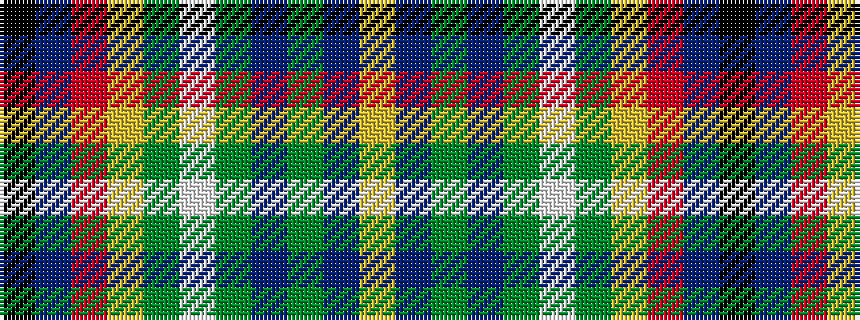

KBRYGWGBGBY

It is a 11 stripe tartan.

<figure class="pat-woven">

<figcaption>idealised sample</figcaption>
</figure>

## Colour Sequence



## Tartans with this colour sequence

| Tartans |
|---------------|
| [Oregon American District Tartan](/variants/s11/ly3db5dg2db2dg2w1dg4lo12r2t2k2~x4/)|
||
| [Oregon, State of](/variants/s11/ly3dp5g2dp2g2w1g4lr12r2t2k2~x4/)|
||
