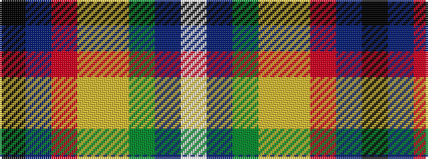

KBRYYGBW

It is a 8 stripe tartan.

<figure class="pat-woven">

<figcaption>idealised sample</figcaption>
</figure>

## Colour Sequence



## Tartans with this colour sequence

| Tartans |
|---------------|
| [Way of the Rainbow](/variants/s8/k1db24r1ly1lyi1g1dbi1lp1~x7/)|
||
