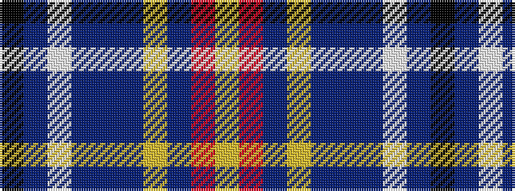

KBWBBBYBRY

It is a 10 stripe tartan.

<figure class="pat-woven">

<figcaption>idealised sample</figcaption>
</figure>

## Colour Sequence



## Tartans with this colour sequence

| Tartans |
|---------------|
| [MacLeroy and Troine 1987](/variants/s10/k4t6w4t6do8t37lr12do46o6lo4/)|
||
