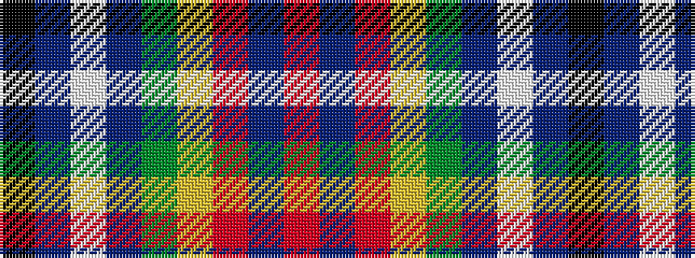

KBWBGYRBR

It is a 9 stripe tartan.

<figure class="pat-woven">

<figcaption>idealised sample</figcaption>
</figure>

## Colour Sequence



## Tartans with this colour sequence

| Tartans |
|---------------|
| [MacCreary (Personal)](/setts/s9/k4db12lb3db4g8lo2r24db4r4~x2/)|
||
