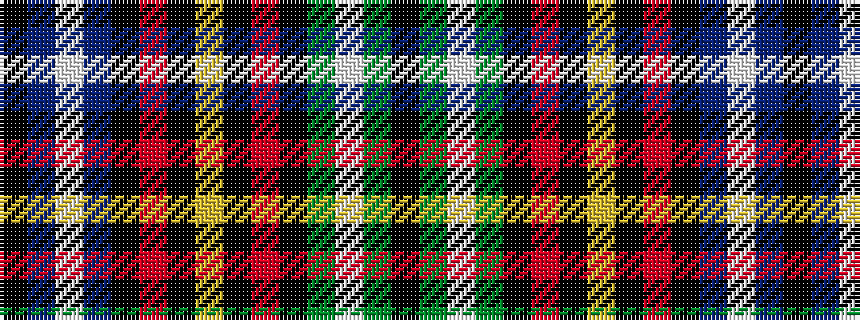

KBWBKRKYKRKGWGK

It is a 15 stripe tartan.

<figure class="pat-woven">

<figcaption>idealised sample</figcaption>
</figure>

## Colour Sequence



## Tartans with this colour sequence

| Tartans |
|---------------|
| [MacGiboney/MacGibboney](/variants/s15/k2dg4w2dg19k2o10k1ly2k1o10k2db19w2db4k2~x2/)|
||
