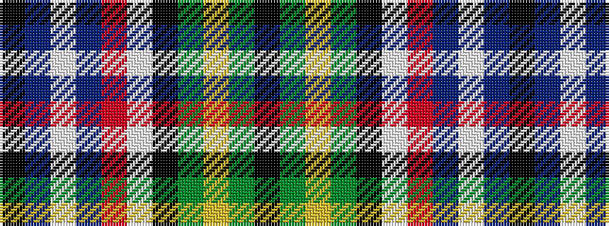

KBWBRWKGYGK

It is a 11 stripe tartan.

<figure class="pat-woven">

<figcaption>idealised sample</figcaption>
</figure>

## Colour Sequence



## Tartans with this colour sequence

| Tartans |
|---------------|
| [Pride, George (Personal)](/setts/s11/k2db15w5db15r15w2k2g4ly3g4k2~x2/)|
||
