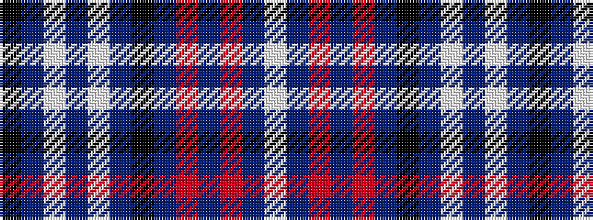

KBWBWBKBRBRBW

It is a 13 stripe tartan.

<figure class="pat-woven">

<figcaption>idealised sample</figcaption>
</figure>

## Colour Sequence



## Tartans with this colour sequence

| Tartans |
|---------------|
| [Yarrow Dress, Purple (Dance)](/setts/s13/k2dp2w2dp2w23dp2k9dp2m2dp21m2dp2w2~x2/)|
||
