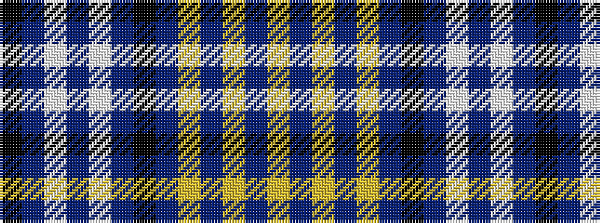

KBWBWBKBYBYBY

It is a 13 stripe tartan.

<figure class="pat-woven">

<figcaption>idealised sample</figcaption>
</figure>

## Colour Sequence



## Tartans with this colour sequence

| Tartans |
|---------------|
| [Yarrow Turquoise Dress Tartan](/variants/s13/k2t2w2t2w27t2k9t3lg3t24lg2t4ly2~x2/)|
||
