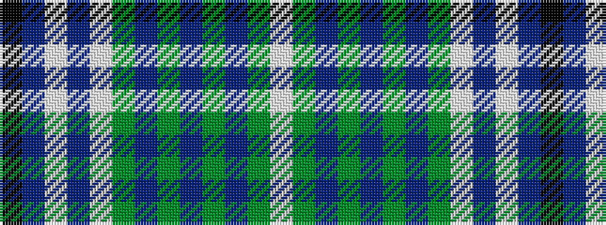

KBWBWGBGBGBGW

It is a 13 stripe tartan.

<figure class="pat-woven">

<figcaption>idealised sample</figcaption>
</figure>

## Colour Sequence



## Tartans with this colour sequence

| Tartans |
|---------------|
| [Crieff Turquoise (Dance)](/variants/s13/k2db2w2db3w38g2p12g3db4g30db2g6w2~x2/)|
||
