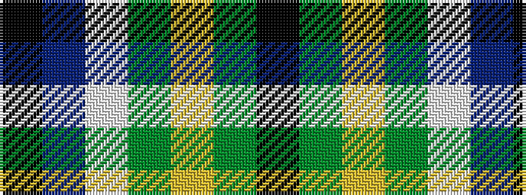

KBWGYGK

It is a 7 stripe tartan.

<figure class="pat-woven">

<figcaption>idealised sample</figcaption>
</figure>

## Colour Sequence



## Tartans with this colour sequence

| Tartans |
|---------------|
| [Chesters, Eric (Personal)](/variants/s7/k12g8ly1dg13lb1db31k8~x2/)|
||
