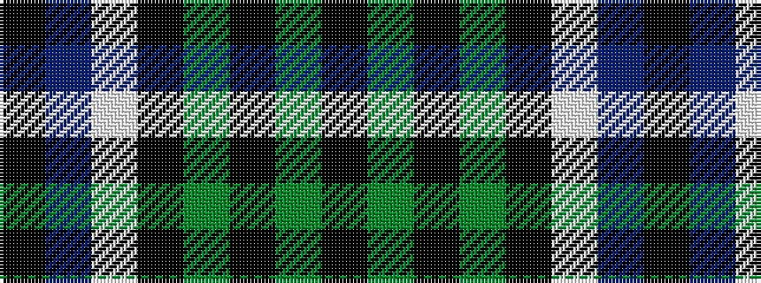

KBWKGKGK

It is a 8 stripe tartan.

<figure class="pat-woven">

<figcaption>idealised sample</figcaption>
</figure>

## Colour Sequence



## Tartans with this colour sequence

| Tartans |
|---------------|
| [Unidentified #36](/setts/s8/k16dg16k2dg16k16w2dp16k1~x2/)|
||
| [Unnamed 6](/setts/s8/k16g16k2g16k16w2p16k1~x2/)|
||
