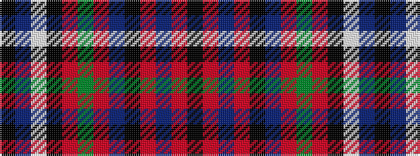

KBWKRGRBKRBRK

It is a 13 stripe tartan.

<figure class="pat-woven">

<figcaption>idealised sample</figcaption>
</figure>

## Colour Sequence



## Tartans with this colour sequence

| Tartans |
|---------------|
| [Oban (District?)](/variants/s13/k2r1db9r2k7db2r6g6r2k12lb1n1k1~x4/)|
||
