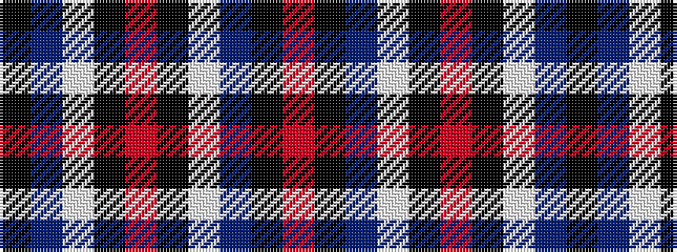

KBWKRKWBKR

It is a 10 stripe tartan.

<figure class="pat-woven">

<figcaption>idealised sample</figcaption>
</figure>

## Colour Sequence



## Tartans with this colour sequence

| Tartans |
|---------------|
| [Callaway Corporate Tartan Tartan Number: 2313. Earliest known date: pre 1997 Designed by Arthur Bell (Scotch Tweeds) for a golf course and golf merchandising company in California. See products available Copyright © Blair Urquhart, Comrie, 2015](/setts/s10/k10n2lb5k5r1k5lb5n2k10r1~x4/)|
||
