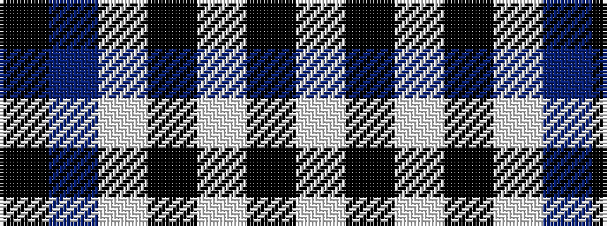

KBWKWKW

It is a 7 stripe tartan.

<figure class="pat-woven">

<figcaption>idealised sample</figcaption>
</figure>

## Colour Sequence



## Tartans with this colour sequence

| Tartans |
|---------------|
| [Strathclyde](/setts/s7/k2b16w2ki16w15k2w2~x2/)|
||
