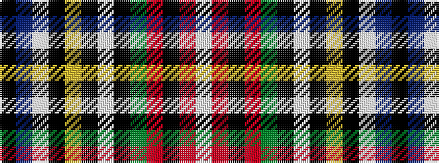

KBWKYKWKGRKRW

It is a 13 stripe tartan.

<figure class="pat-woven">

<figcaption>idealised sample</figcaption>
</figure>

## Colour Sequence



## Tartans with this colour sequence

| Tartans |
|---------------|
| [Stewart Black](/setts/s13/k58db5w5k10ly3k3w3k3g14r11k3r4w3~x2/)|
||
| [Stuart/Stewart Black #2](/setts/s13/k58db5w5k10ly3k3w3k3dg14r11k3r4w3~x2/)|
||
