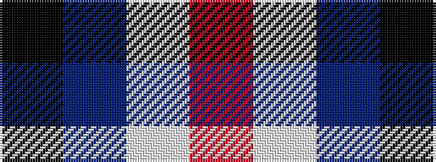

KBWR

It is a 4 stripe tartan.

<figure class="pat-woven">

<figcaption>idealised sample</figcaption>
</figure>

## Colour Sequence



## Tartans with this colour sequence

| Tartans |
|---------------|
| [City of London (Corporate)](/variants/s4/k5n24w24r5~x2/)|
||
| [Raven (Fashion)](/variants/s4/k19db18w9r3~x4/)|
||
