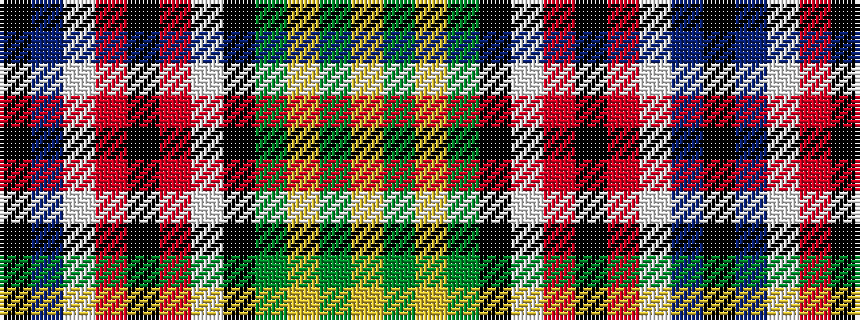

KBWRKRWKGYGY

It is a 12 stripe tartan.

<figure class="pat-woven">

<figcaption>idealised sample</figcaption>
</figure>

## Colour Sequence



## Tartans with this colour sequence

| Tartans |
|---------------|
| [Ogg of Tarragann](/setts/s12/k2t6w1r14k1r14w1k6dg10lo1dg2lo2~x2/)|
||
| [Ogg of Tarragann (Personal)](/setts/s12/k2t6w1r14k1r14w1k6g10lo1g2lo2~x2/)|
||
