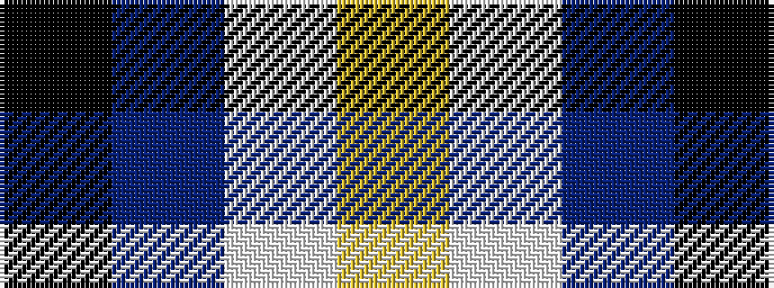

KBWY

It is a 4 stripe tartan.

<figure class="pat-woven">

<figcaption>idealised sample</figcaption>
</figure>

## Colour Sequence



## Tartans with this colour sequence

| Tartans |
|---------------|
| [C-Tec N.I. Ltd](/variants/s4/k62db15w6ly4~x2/)|
||
