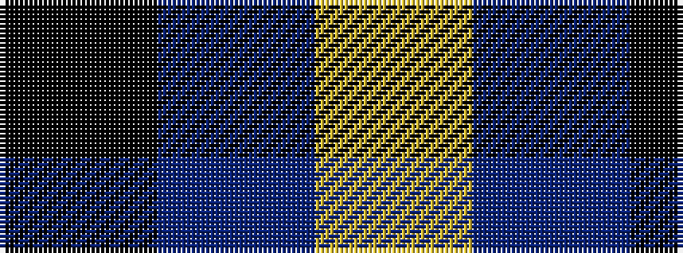

KBY

It is a 3 stripe tartan.

<figure class="pat-woven">

<figcaption>idealised sample</figcaption>
</figure>

## Colour Sequence



## Tartans with this colour sequence

| Tartans |
|---------------|
| [Kazakhstan Relic (Artefact)](/setts/s3/lo5db5k3~x4/)|
||
| [Masai Shuka 04 (Artefact)](/setts/s3/ly20db10k3~x2/)|
||
| [Mother's Pride (Corporate)](/setts/s3/k10db10lo1~x4/)|
||
| [Poulain League (Corporate)](/setts/s3/ly6t38k3~x2/)|
||
| [Westwater (Edinburgh, 2012)](/setts/s3/k62t33ly1~x2/)|
||
| [Westwater (Personal)](/setts/s3/k62b33ly1~x2/)|
||
| [Wilson's, No 118](/setts/s3/k5t4ly1~x2/)|
||
