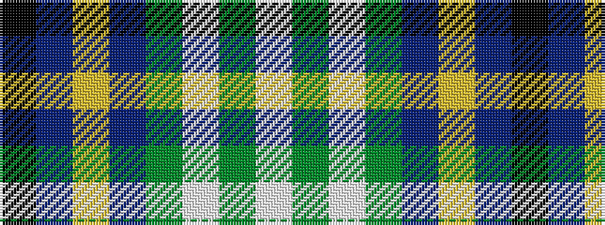

KBYBGWGW

It is a 8 stripe tartan.

<figure class="pat-woven">

<figcaption>idealised sample</figcaption>
</figure>

## Colour Sequence



## Tartans with this colour sequence

| Tartans |
|---------------|
| [Ship Hector](/variants/s8/k4db9ly6db22g4w20g6w4/)|
||
| [Ship Hector, The (Commemorative)](/variants/s8/k3db10ly5db16g3w16g5w3~x2/)|
||
