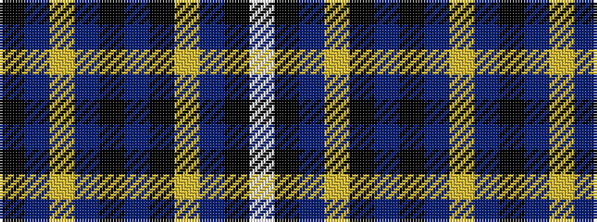

KBYBKBKYBKW

It is a 11 stripe tartan.

<figure class="pat-woven">

<figcaption>idealised sample</figcaption>
</figure>

## Colour Sequence



## Tartans with this colour sequence

| Tartans |
|---------------|
| [Pride of Scotland Platinum Fashion Tartan](/variants/s11/k7n2lr2n2k13n2k2lr2n13k26lp2~x2/)|
||
