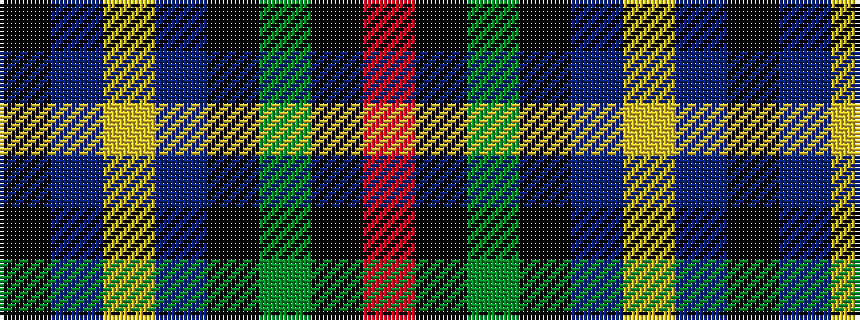

KBYBKGKR

It is a 8 stripe tartan.

<figure class="pat-woven">

<figcaption>idealised sample</figcaption>
</figure>

## Colour Sequence



## Tartans with this colour sequence

| Tartans |
|---------------|
| [Fox Hunting](/setts/s8/r4k2g36k2b18ly3b18k2~x2/)|
||
