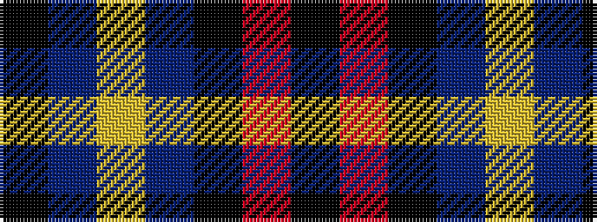

KBYBKRK

It is a 7 stripe tartan.

<figure class="pat-woven">

<figcaption>idealised sample</figcaption>
</figure>

## Colour Sequence



## Tartans with this colour sequence

| Tartans |
|---------------|
| [Perkins (2015)](/variants/s7/k3t10lo5t29k10r6k2~x2/)|
||
| [Perkins 2015](/variants/s7/k3t10ly5t29k10r6k2~x2/)|
||
