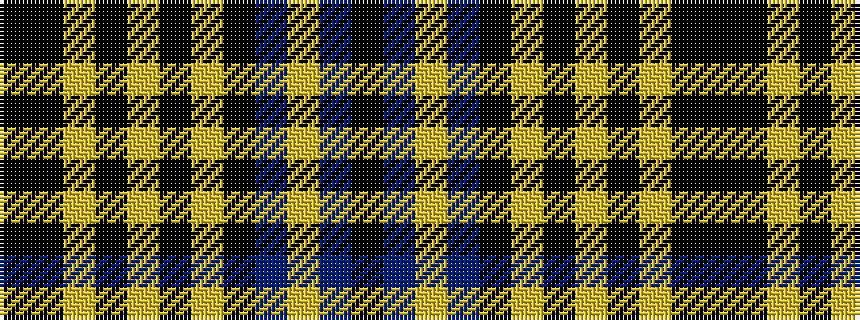

KBYBKYKYKYKK

It is a 12 stripe tartan.

<figure class="pat-woven">

<figcaption>idealised sample</figcaption>
</figure>

## Colour Sequence



## Tartans with this colour sequence

| Tartans |
|---------------|
| [Daks (Chino Check) (Fashion)](/setts/s12/k22k3lo7k2lo2k2lo2k10db6lo2db3k2~x2/)|
||
