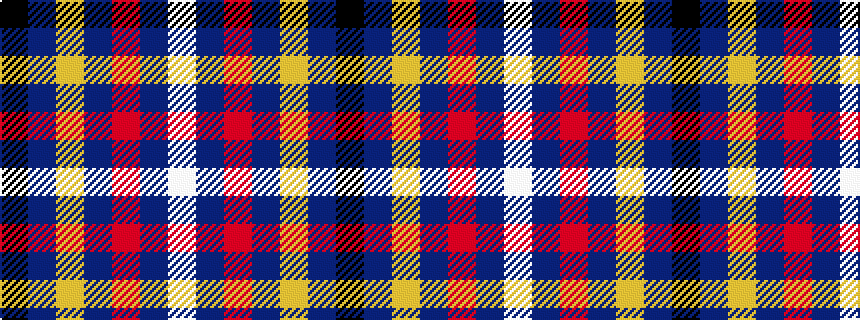

KBYBRBW

It is a 7 stripe tartan.

<figure class="pat-woven">

<figcaption>idealised sample</figcaption>
</figure>

## Colour Sequence



## Tartans with this colour sequence

| Tartans |
|---------------|
| [Blackdown Hills Corporate Tartan](/variants/s7/k4n4lo1n4r4db4w1~x8/)|
||
