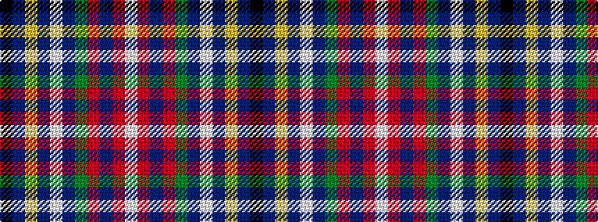

KBYBWBGRBRW

It is a 11 stripe tartan.

<figure class="pat-woven">

<figcaption>idealised sample</figcaption>
</figure>

## Colour Sequence



## Tartans with this colour sequence

| Tartans |
|---------------|
| [Flotilla Navy](/variants/s11/k36db6ly1db1lb1db1dy8o4db1o2lb1~x4/)|
||
