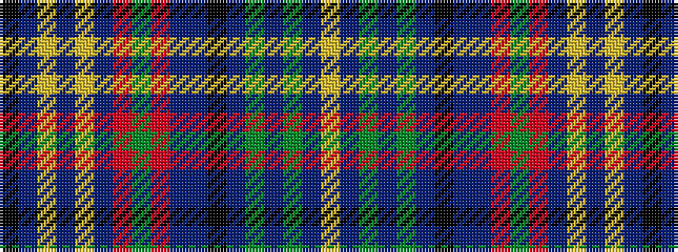

KBYBYBRGRBBKBGBGBY

It is a 18 stripe tartan.

<figure class="pat-woven">

<figcaption>idealised sample</figcaption>
</figure>

## Colour Sequence



## Tartans with this colour sequence

| Tartans |
|---------------|
| [Harmon of Plenderleith (Personal)](/setts/s18/k2t6ly2t2ly2t19r2g2r2t2db4k2db11g2db2g2db6ly2~x2/)|
||
| [Harmon of Plenderleith (Personal)](/setts/s18/k2db6lo2db2lo2db19r2y2r2db2dt4k2dt11y2dt2y2dt6lo2~x2/)|
||
| [Harmon of Plenderleith Personal Tartan Tartan Number: 10021. Earliest known date: Mar. 2009 A personal tartan for the Baron of Plenderleith, his family and members of his household. Developed with the help of the House of Tartan, Comrie, Perthshire. See products available Copyright © Blair Urquhart, Comrie, 2015](/setts/s18/k2t6lo2t2lo2t19r2y2r2t2dt4k2dt11y2dt2y2dt6lo2~x2/)|
||
