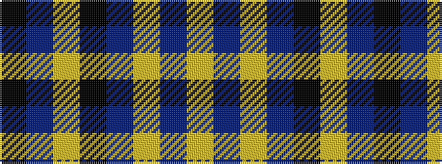

KBYKBYBY

It is a 8 stripe tartan.

<figure class="pat-woven">

<figcaption>idealised sample</figcaption>
</figure>

## Colour Sequence



## Tartans with this colour sequence

| Tartans |
|---------------|
| [1891 (Commemorative)](/setts/s8/k40dt10ly1k40dt10ly2dt10ly4~x2/)|
||
