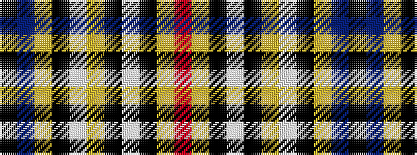

KBYKWYKWKYR

It is a 11 stripe tartan.

<figure class="pat-woven">

<figcaption>idealised sample</figcaption>
</figure>

## Colour Sequence



## Tartans with this colour sequence

| Tartans |
|---------------|
| [Pride of Scotland Gold](/setts/s11/k9n2lo2k2lb18lo2k2lb1k19lo33r2~x2/)|
||
