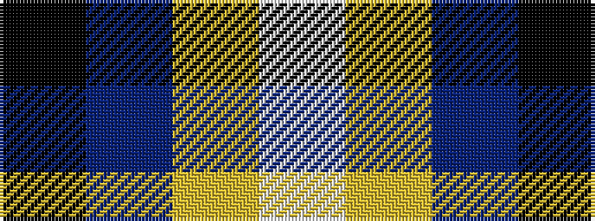

KBYW

It is a 4 stripe tartan.

<figure class="pat-woven">

<figcaption>idealised sample</figcaption>
</figure>

## Colour Sequence



## Tartans with this colour sequence

| Tartans |
|---------------|
| [Perry (Calgary), Alex (Personal)](/setts/s4/k62dt24lo5w3~x2/)|
||
| [Perry, Alex (Personal)](/setts/s4/k62n24lo5w8~x2/)|
||
