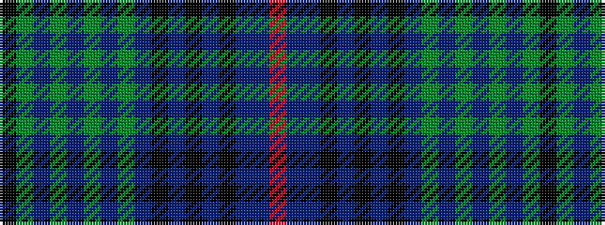

KGBGBGBGBKBKBKBBR

It is a 17 stripe tartan.

<figure class="pat-woven">

<figcaption>idealised sample</figcaption>
</figure>

## Colour Sequence



## Tartans with this colour sequence

| Tartans |
|---------------|
| [Rendell, Charles (Personal)](/variants/s17/k2g2p1g2p1g2p1g12db4k3db3k3db3k3db4dp24r2~x2/)|
||
