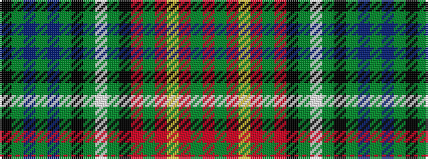

KGBGBGKGWGKRGRYRGR

It is a 18 stripe tartan.

<figure class="pat-woven">

<figcaption>idealised sample</figcaption>
</figure>

## Colour Sequence



## Tartans with this colour sequence

| Tartans |
|---------------|
| [Langston (Personal)](/setts/s18/k14g2t14g3t14g2k14g14w2g14k14r2g2r10ly4r10g2r2~x2/)|
||
