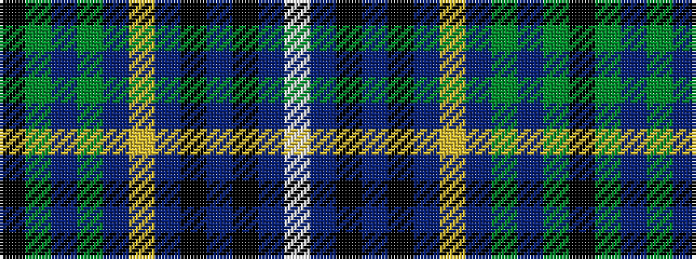

KGBGBYBKBKBW

It is a 12 stripe tartan.

<figure class="pat-woven">

<figcaption>idealised sample</figcaption>
</figure>

## Colour Sequence



## Tartans with this colour sequence

| Tartans |
|---------------|
| [Aceo](/variants/s12/k2y10n5y20n5lo3n7k3n7k4n4w2~x2/)|
||
