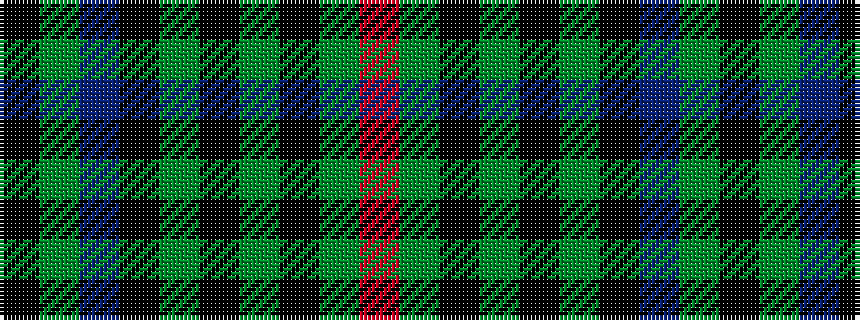

KGBKGKGKGR

It is a 10 stripe tartan.

<figure class="pat-woven">

<figcaption>idealised sample</figcaption>
</figure>

## Colour Sequence



## Tartans with this colour sequence

| Tartans |
|---------------|
| [MacAndreis](/setts/s10/k3dg4dt25k16dg3k3dg3k3dg6o3~x2/)|
||
| [MacAndreis (Personal)](/setts/s10/k3dg4db25k16dg3k3dg3k3dg6r3~x2/)|
||
