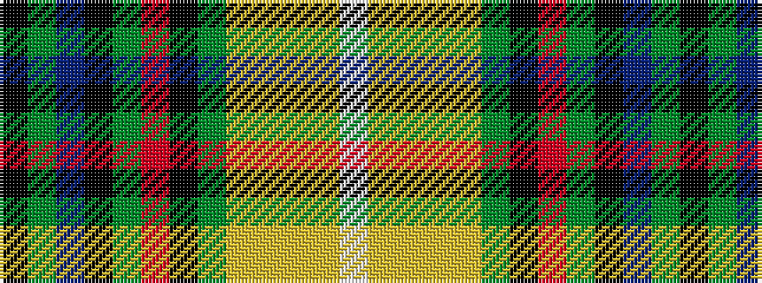

KGBKGRKGYYYYW

It is a 13 stripe tartan.

<figure class="pat-woven">

<figcaption>idealised sample</figcaption>
</figure>

## Colour Sequence



## Tartans with this colour sequence

| Tartans |
|---------------|
| [Mississippi](/setts/s13/k20g40db4k20g20r8k20g20ly1lo1ly1lo1w4/)|
||
| [Mississippi (Fashion)](/setts/s13/k20g40db4k20g20r8k20g20ly1lo1ly1lo1w4~x2/)|
||
