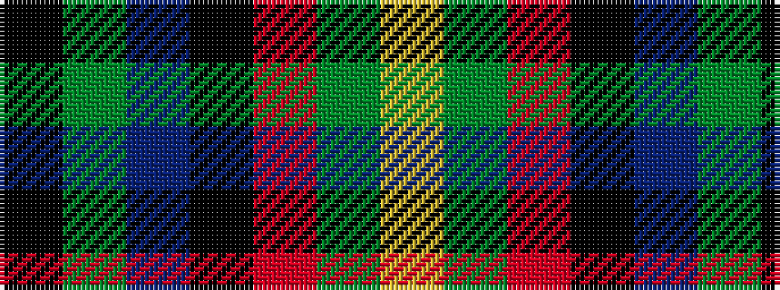

KGBKRGY

It is a 7 stripe tartan.

<figure class="pat-woven">

<figcaption>idealised sample</figcaption>
</figure>

## Colour Sequence



## Tartans with this colour sequence

| Tartans |
|---------------|
| [McCann of Castlecraig (Personal)](/setts/s7/k64y12n6k15o1y5lr1~x2/)|
||
