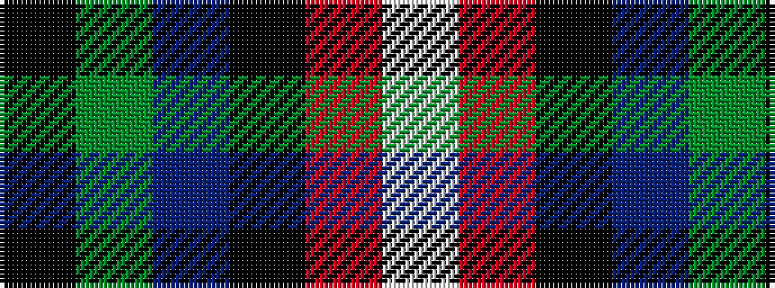

KGBKRW

It is a 6 stripe tartan.

<figure class="pat-woven">

<figcaption>idealised sample</figcaption>
</figure>

## Colour Sequence



## Tartans with this colour sequence

| Tartans |
|---------------|
| [Bryant (Dalgleish) (Personal)](/variants/s6/lb3r30k18db6g30k2~x2/)|
||
