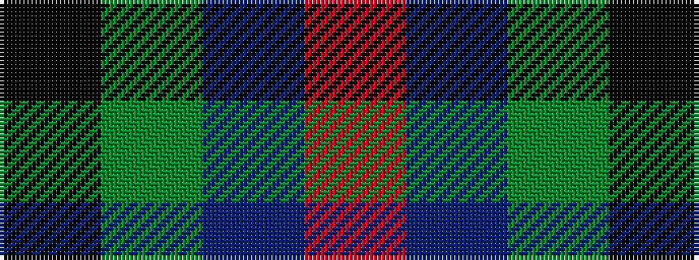

KGBR

It is a 4 stripe tartan.

<figure class="pat-woven">

<figcaption>idealised sample</figcaption>
</figure>

## Colour Sequence



## Tartans with this colour sequence

| Tartans |
|---------------|
| [Heslop, William D Name Tartan](/variants/s4/k44dg12dt1o6~x2/)|
||
| [Tennant](/variants/s4/k18g18dr21r4~x2/)|
||
