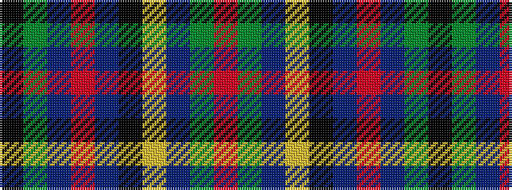

KGBRBKYBGR

It is a 10 stripe tartan.

<figure class="pat-woven">

<figcaption>idealised sample</figcaption>
</figure>

## Colour Sequence



## Tartans with this colour sequence

| Tartans |
|---------------|
| [Unidentified #37](/variants/s10/k6dg14t2r3t2k16ly2b16dg16r3~x2/)|
||
| [Unnamed 4](/variants/s10/k6g14t2r3t2k16ly2b16g16r3~x2/)|
||
