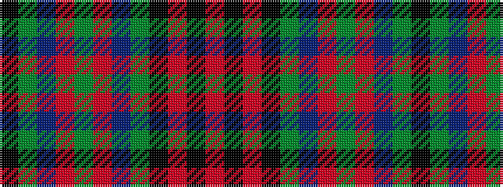

KGBRGRBGKRKR

It is a 12 stripe tartan.

<figure class="pat-woven">

<figcaption>idealised sample</figcaption>
</figure>

## Colour Sequence



## Tartans with this colour sequence

| Tartans |
|---------------|
| [ABF The Soldiers' Charity](/setts/s12/k25dg29b24r2dg11r2b24dg29k25o4k5r4~x2/)|
||
