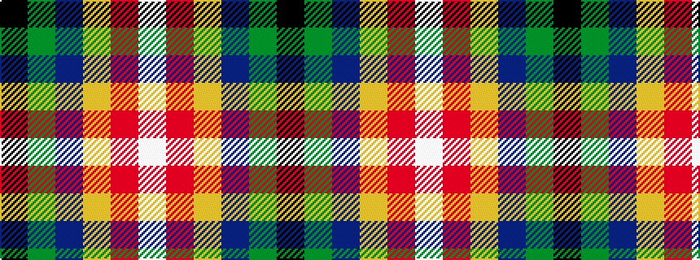

KGBYRW

It is a 6 stripe tartan.

<figure class="pat-woven">

<figcaption>idealised sample</figcaption>
</figure>

## Colour Sequence



## Tartans with this colour sequence

| Tartans |
|---------------|
| [Official Glasgow 2014, The](/variants/s6/k3g44db27ly6r10w3~x2/)|
||
