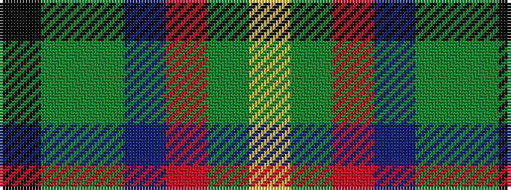

KGGBRGY

It is a 7 stripe tartan.

<figure class="pat-woven">

<figcaption>idealised sample</figcaption>
</figure>

## Colour Sequence



## Tartans with this colour sequence

| Tartans |
|---------------|
| [Snelgrove (Name)](/setts/s7/k2g6dy4t1r18dy5lo1~x4/)|
||
