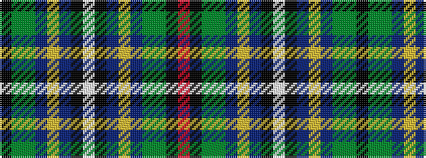

KGGBYBKWKBYBGGKR

It is a 16 stripe tartan.

<figure class="pat-woven">

<figcaption>idealised sample</figcaption>
</figure>

## Colour Sequence



## Tartans with this colour sequence

| Tartans |
|---------------|
| [Hughes Interconnection Int.](/setts/s16/w4k2b18ly4b18dy26g18k1m2~x2/)|
||
