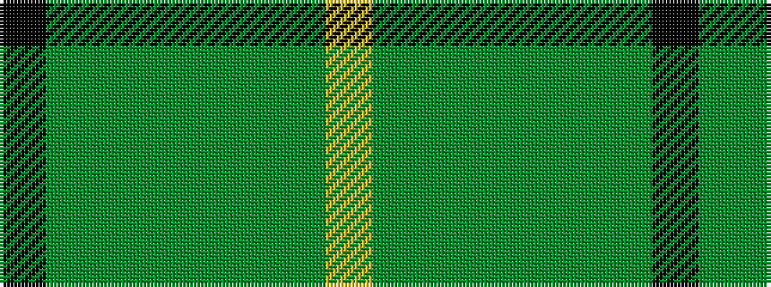

KGGGGGGY

It is a 8 stripe tartan.

<figure class="pat-woven">

<figcaption>idealised sample</figcaption>
</figure>

## Colour Sequence



## Tartans with this colour sequence

| Tartans |
|---------------|
| [Brocéliande (Restricted)](/variants/s8/k3g11dgii15dgi5dgii10dg14dgi14ly2~x2/)|
||
