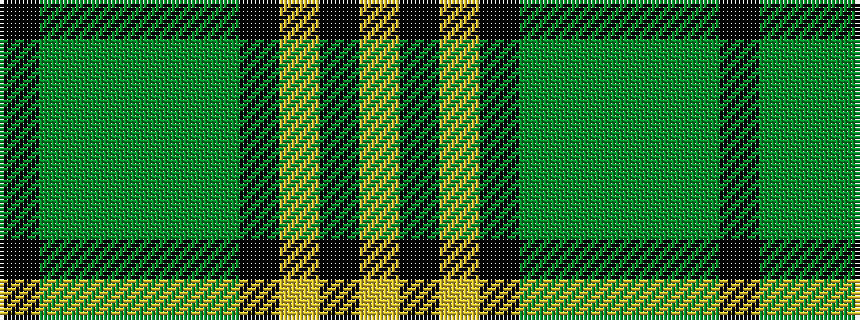

KGGGGGKYKY

It is a 10 stripe tartan.

<figure class="pat-woven">

<figcaption>idealised sample</figcaption>
</figure>

## Colour Sequence



## Tartans with this colour sequence

| Tartans |
|---------------|
| [Sin-Cos](/setts/s10/k60g64g5g8g5g64k60ly8k8ly8/)|
||
| [Sin-Cos (Corporate)](/setts/s10/k60g64dg5g8dg5g64k60ly8k8ly8/)|
||
