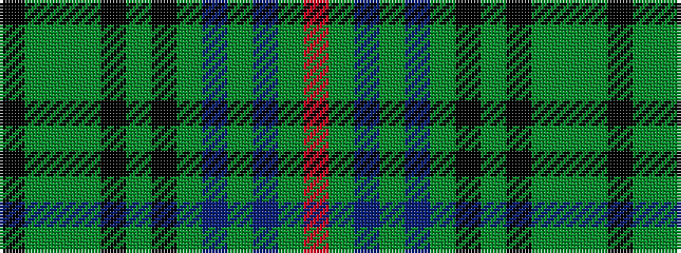

KGGGKGKGBGBGR

It is a 13 stripe tartan.

<figure class="pat-woven">

<figcaption>idealised sample</figcaption>
</figure>

## Colour Sequence



## Tartans with this colour sequence

| Tartans |
|---------------|
| [Bartlett, Chris (Personal)](/setts/s13/r4y40dt12y2dt12y30k2y4k2y4y2y3k3~x2/)|
||
