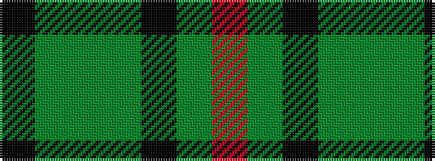

KGGGKGR

It is a 7 stripe tartan.

<figure class="pat-woven">

<figcaption>idealised sample</figcaption>
</figure>

## Colour Sequence



## Tartans with this colour sequence

| Tartans |
|---------------|
| [Milne-Murtagh (2009)](/setts/s7/m5y2k30y26y2y2k4~x2/)|
||
