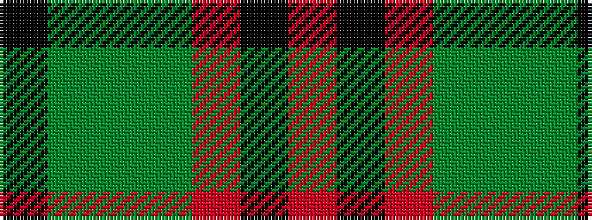

KGGGRKR

It is a 7 stripe tartan.

<figure class="pat-woven">

<figcaption>idealised sample</figcaption>
</figure>

## Colour Sequence



## Tartans with this colour sequence

| Tartans |
|---------------|
| [PSD: Operation Iraqi Freedom](/setts/s7/k2y1dg12y12ri12k1r2~x4/)|
||
