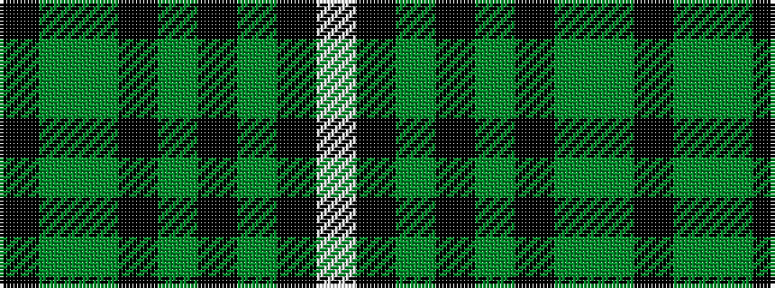

KGGKGKGKW

It is a 9 stripe tartan.

<figure class="pat-woven">

<figcaption>idealised sample</figcaption>
</figure>

## Colour Sequence



## Tartans with this colour sequence

| Tartans |
|---------------|
| [Dropkick Murphys](/setts/s9/k6gi55g6k85g4k4gi12k2w5/)|
||
