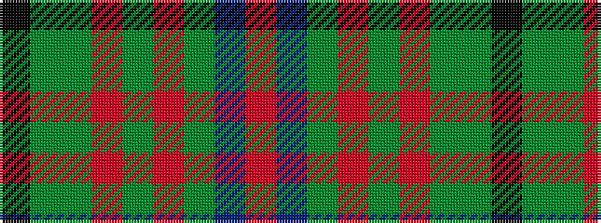

KGGRGRGBR

It is a 9 stripe tartan.

<figure class="pat-woven">

<figcaption>idealised sample</figcaption>
</figure>

## Colour Sequence



## Tartans with this colour sequence

| Tartans |
|---------------|
| [Glens of Corbie (Corporate)](/setts/s9/k3g30y20o6y3o3y3dt20r2~x2/)|
||
